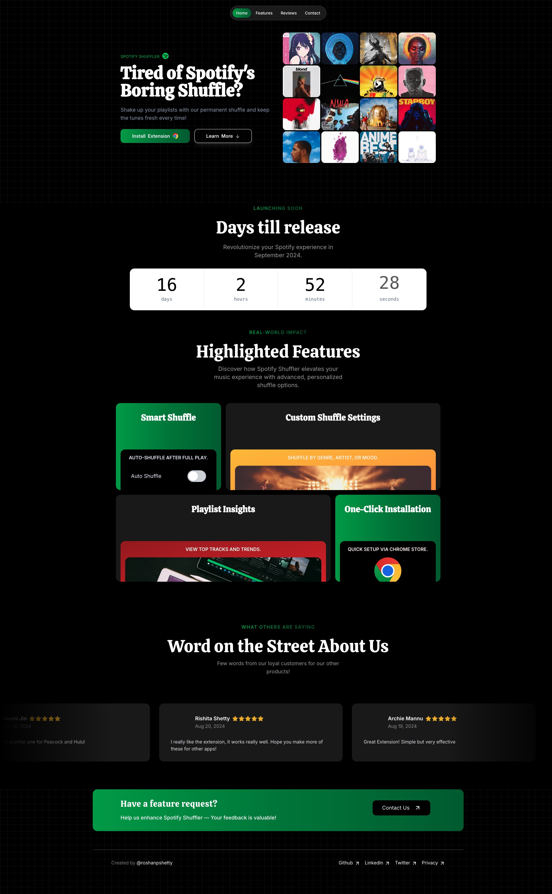

# 🎉 **Spotify Playlist Randomizer Landing Page**

Welcome to the **Spotify Playlist Randomizer Landing Page** repository! 🚀 This is a beautifully designed landing page for a Chrome extension that enhances your Spotify experience by permanently randomizing your playlists.

## 📸 **Screenshots**


_The main landing page of the Spotify Playlist Randomizer._


## 🛠 **Tech Stack**

- **Next.js**: A powerful React framework for server-rendered or statically generated pages.
- **TailwindCSS**: A utility-first CSS framework for rapid UI development.
- **Framer Motion**: A library for animations and interactions.
- **TypeScript**: A superset of JavaScript that adds static types.

## 🚀 **Features**

- **Modern Design**: A sleek and stylish design that aligns with Spotify's theme.
- **Responsive Layout**: Fully responsive and optimized for various devices.
- **Smooth Animations**: Engaging animations for a better user experience.
- **Contact Form**: Easy-to-use contact form to get in touch with us.

## 🖥 **Preview**

You can see the landing page in action at [http://localhost:3000](http://localhost:3000) after running the project locally.

## 📦 **Installation**

1. **Clone the Repository**:

   ```bash
   git clone https://github.com/yourusername/spotify-playlist-randomizer-landing-page.git
   ```

2. **Navigate to the Project Directory**:

   ```bash
   cd spotify-playlist-randomizer-landing-page
   ```

3. **Install Dependencies**:

   ```bash
   npm install
   ```

4. **Run the Development Server**:

   ```bash
   npm run dev
   ```

   Visit [http://localhost:3000](http://localhost:3000) to view the landing page.

## 🔧 **Development**

Feel free to contribute to this project by creating issues or submitting pull requests. Here are some guidelines to follow:

- **Code Style**: Follow the existing code style and conventions.
- **Commit Messages**: Write clear and concise commit messages.
- **Testing**: Ensure your changes are well-tested.

## 🤝 **Contributing**

We welcome contributions to enhance this landing page! If you have suggestions or improvements, please:

1. Fork the repository.
2. Create a new branch (`git checkout -b feature/YourFeature`).
3. Commit your changes (`git commit -am 'Add some feature'`).
4. Push to the branch (`git push origin feature/YourFeature`).
5. Create a new Pull Request.

## 📧 **Contact**

For any questions or feedback, you can reach out to us via:

- **Email**: [roshanshetty2000@gmail.com](mailto:roshanshetty2000@gmail.com)
- **Twitter**: [@roshanpshetty](https://twitter.com/roshanpshetty)
- **GitHub**: [roshanpshetty](https://github.com/roshanpshetty)

## 📝 **License**

This project is licensed under the MIT License. See the [LICENSE](./LICENSE) file for more details.
